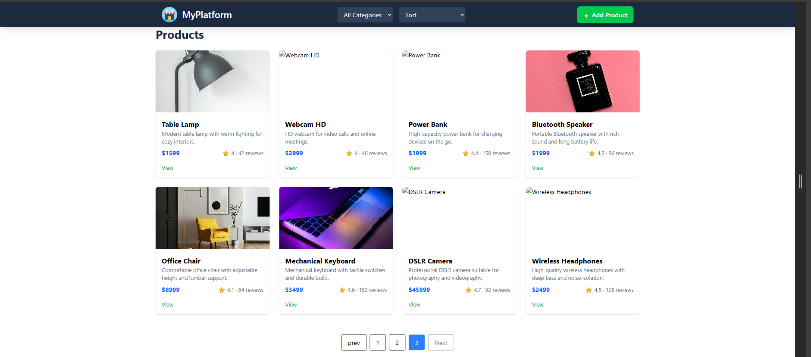
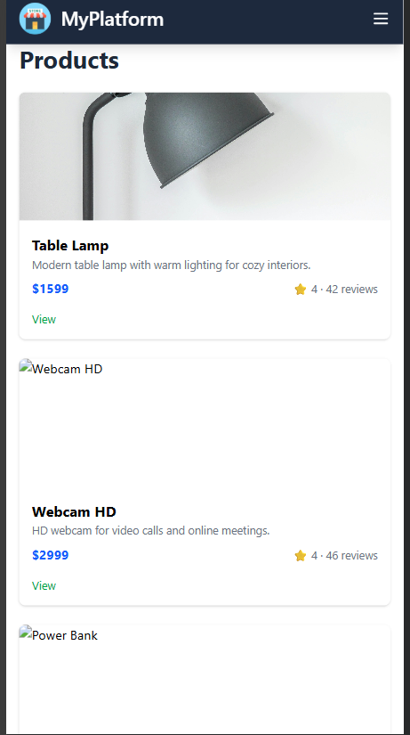

# 🛒 Mini MERN Commerce App

[](https://reactjs.org/) [](https://nodejs.org/) [](https://www.mongodb.com/) [](LICENSE)

A production-ready mini e-commerce platform built with the MERN stack that allows users to browse products, search efficiently with debouncing, and add products with image uploads. The application focuses on performance, clean UI, and scalability.

---

## ✨ Features

- Product listing with search, filter, and sorting
- **Debounced search** for optimized performance
- Add new products
- Image upload and storage using **Cloudinary**
- Skeleton loading for smooth user experience
- Error Boundaries for graceful error handling
- Fully responsive design (desktop & mobile)

---

## 🛠️ Tech Stack

| Frontend | Backend |
|----------|---------|
| React - UI library | Node.js - Runtime environment |
| Vite - Build tool & dev server | Express.js - Web framework |
| Tailwind CSS - Utility-first CSS | MongoDB - NoSQL database |
| Axios - HTTP client | Mongoose - ODM for MongoDB |
| React Icons - Icon library | Multer - File upload middleware |
| Context API + useReducer | CORS - Cross-origin resource sharing |
| Formik + Yup - Form validation | dotenv - Environment variable management |

---

## 🌐 Deployment

- **Frontend:** [Vercel](https://vercel.com/)
- **Backend:** [Render](https://render.com/)

---

## ☁️ Image Management

- Product images are uploaded to **Cloudinary**
- Cloudinary is configured using environment variables for secure uploads
- Image URLs are stored in MongoDB
- Images are dynamically rendered on the frontend

---

## 📂 Project Structure

```
mini-commerce/
├── screenshots/
├── client/
│   ├── public/
│   ├── src/
│   │   ├── components/
│   │   ├── contextApi/
│   │   ├── pages/
│   │   ├── App.jsx
│   │   ├── main.jsx
│   │   └── index.css
│   ├── .env
│   ├── .gitignore
│   ├── eslint.config.js
│   ├── index.html
│   ├── package.json
│   ├── package-lock.json
│   ├── vite.config.js
│   └── README.md
├── server/
│   ├── public/
│   ├── src/
│   │   ├── controllers/
│   │   ├── models/
│   │   ├── routes/
│   │   └── config/
│   ├── uploads/
│   ├── .env
│   ├── .gitignore
│   ├── package.json
│   ├── package-lock.json
│   └── README.md
└── README.md
```

---

## 🚀 Getting Started

Follow these steps to run the project locally:

### 1. Clone the repository

```bash
git clone https://github.com/vyasan-6-6/MINI-MERN-ECOMMERCE-APP.git
cd mini-commerce
```

### 2. Install dependencies

**Frontend:**
```bash
cd client
npm install
```

**Backend:**
```bash
cd /server
npm install
```

### 3. Set up environment variables

Create a `.env` file in both `client` and `server` directories with the necessary keys:
- MongoDB URI
- Cloudinary keys
- API endpoints

### 4. Run the project

**Frontend:**
```bash
cd /client
npm run dev
```

**Backend:**
```bash
cd /server
npm run dev
```

### 5. Open in browser

- **Frontend:** http://localhost:5173
- **Backend API:** http://localhost:5000 (or your configured port)

---

## 📸 Screenshots

### Desktop View


### Mobile View

---

## 🌐 Live Demo

- **Frontend:** [Deployment Link](https://mini-mern-ecommerce-app.vercel.app)
- **Backend API:** [API Link](https://mini-mern-ecommerce-app.onrender.com)

---

## 🔮 Future Improvements

- Authentication & Authorization
- Cart and Checkout Flow
- Payment Gateway Integration
- Admin Dashboard
- Order Management System

---

## 🤝 Contributing

Contributors are welcome! Feel free to fork the repository and submit a pull request.

---

## ⭐ Additional Highlights

- Clean and scalable folder structure
- Performance-focused features (debouncing, skeleton loading)
- Production-ready deployment setup

---

## 👨‍💻 Author

**VYASAN K S**  
Full-Stack Developer  
[LinkedIn: VYASAN K S](www.linkedin.com/in/vyasanks)